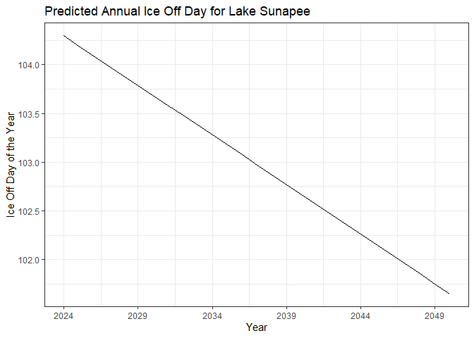

Assignment Part 1: Lake Ice
================
Quinn Thomas
2023-04-18 07:59:46

``` r
library(tidyverse)
library(tidymodels)
tidymodels_prefer()

library(readxl)
```

## Objective

Apply the tidymodel approach above to the ice-off data from the second
module. Your goal is to translate the linear regression from the the
lake ice module into the tidymodels machine learning framework.

## Tips

- You should be using the same model and engine as in
  `machine-learning-101.Rmd`
- Since the data are already processed you won’t have any steps in your
  recipe. Your recipe will just have a formula in the `recipe()`

## Step 1: Obtain data

First, copy data from ice lake phenology model into your data
subdirectory in this module.

**Question 1:** Provide code for reading in data and filtering the data
to only be Lake Sunapee.

**Answer 1:**

``` r
lake_ice_file <- "C:/Users/lchia/OneDrive/Documents/Spring 2023/EDS Assignments/assign3-lake-ice-lilliangc/data/lake_ice_off_data_2022.xlsx"

ice_data <- read_excel(lake_ice_file, sheet = "data")

sunapee <- ice_data |> 
  filter(lake_name == "Sunapee")
```

## Step 2: Pre-process data

### Split data into training/testing sets

**Question 2:** Provide code for splitting data

**Answer 2:**

``` r
split <- initial_split(sunapee, prop = 0.80, strata = year)

train_data <- training(split)
test_data <- testing(split)
```

### Feature engineering using a recipe

**Question 3:** Provide code that defines the recipe for feature
engineering

**Answer 3:** \[no feature engineering just give it the recipe\]

``` r
sunapee_recipe <- train_data |> 
  recipe(ice_off_doy ~ . ) |> 
  step_rm(lake_name) 

sunapee_recipe
```

    ## 

    ## ── Recipe ──────────────────────────────────────────────────────────────────────

    ## 

    ## ── Inputs

    ## Number of variables by role

    ## outcome:   1
    ## predictor: 2

    ## 

    ## ── Operations

    ## • Variables removed: lake_name

## Step 3: Specify model and workflow

### Define model type and mode

**Question 4:** Provide code that defines the model \[set engine as “lm”
for linear regression\]

**Answer 4:**

``` r
linear_mod <- 
  linear_reg(mode = "regression") |> 
  set_engine("lm")
```

### Define workflow

**Question 5:** Provide code that defines the workflow

**Answer 5:**

``` r
sunapee_wflow <-
  workflow() |> 
  add_model(linear_mod) |> 
  add_recipe(sunapee_recipe)
```

## Step 4: Train model on Training Data

**Question 6:** Provide code that trains the model

**Answer 6:**

``` r
sunapee_fit <- sunapee_wflow |> 
  fit(data = train_data)
```

## Step 5: Predict Test Data

**Question 7:** Provide code that predicts the test data

**Answer 7:**

``` r
predictions <- predict(sunapee_fit, new_data = test_data)

pred_test <- bind_cols(test_data, predictions)
```

## Step 6: Evaluate model

**Question 8:** Provide code calculates the rmse and r2 for the test
data

**Answer 8:**

``` r
multi_metric <- metric_set(rmse, rsq)

metric_table <- pred_test |> 
multi_metric(truth = ice_off_doy, estimate = .pred)

metric_table
```

    ## # A tibble: 2 × 3
    ##   .metric .estimator .estimate
    ##   <chr>   <chr>          <dbl>
    ## 1 rmse    standard       9.04 
    ## 2 rsq     standard       0.187

## Step 7: Deploy model

### Obtain new data

``` r
#new_data <- tibble(year = seq(2024, 2050, by = 1))

#use this
new_data <- tibble(lake_name = "Sunapee",
                   year = seq(2024,2050, by = 1))

new_data
```

    ## # A tibble: 27 × 2
    ##    lake_name  year
    ##    <chr>     <dbl>
    ##  1 Sunapee    2024
    ##  2 Sunapee    2025
    ##  3 Sunapee    2026
    ##  4 Sunapee    2027
    ##  5 Sunapee    2028
    ##  6 Sunapee    2029
    ##  7 Sunapee    2030
    ##  8 Sunapee    2031
    ##  9 Sunapee    2032
    ## 10 Sunapee    2033
    ## # … with 17 more rows

### Make new prediction

**Question 9:** Provide code that predicts the ice-off day of year for
the new data

**Answer 9:**

``` r
new_predictions <- predict(sunapee_fit, new_data = new_data)

new_predicted <- bind_cols(new_data, new_predictions) |>
  select(lake_name, year, .pred)
```

**Question 10:** Plot the predictions of the new data (year vs. doy for
the new data)

**Answer 10:**

``` r
new_predicted |> ggplot(aes(year, .pred)) +
  geom_line() +
  theme_bw() +
  scale_x_continuous(breaks = seq(2024, 2050, by = 5)) +
  labs(x = "Year", y = "Ice Off Day of the Year") +
  ggtitle("Predicted Annual Ice Off Day for Lake Sunapee")
```

<!-- -->

## Knitting and committing

Remember to Knit your document as a `github_document` and comment+push
to GitHub your code, knitted document, and any files in the `figure-gfm`
subdirectory that was created when you knitted the document.
